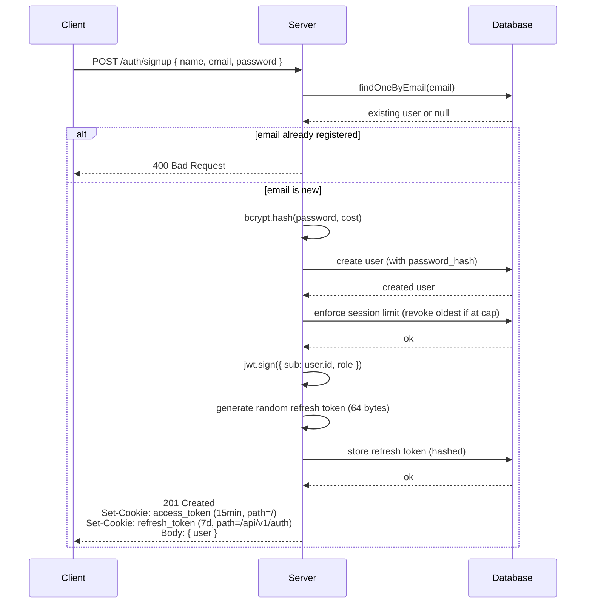
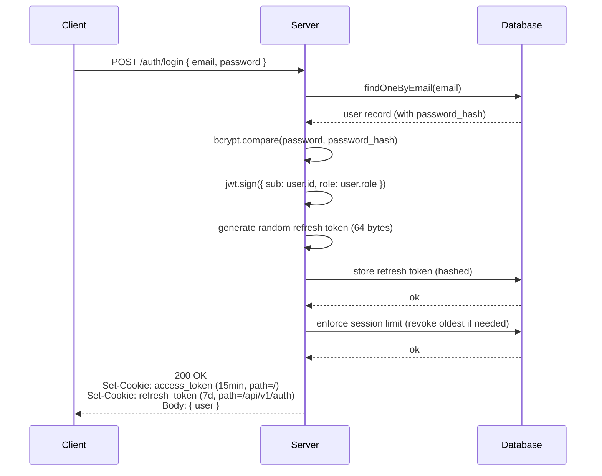
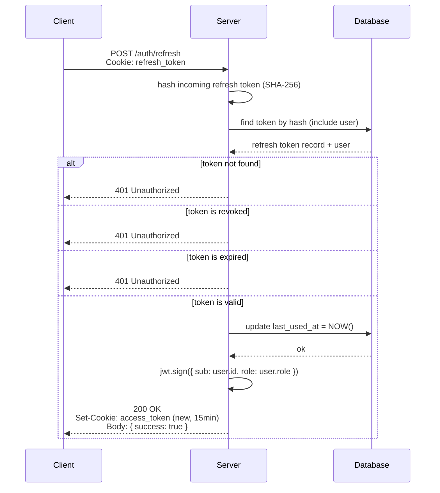
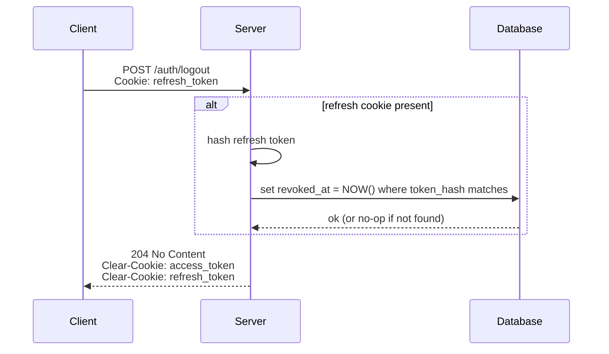
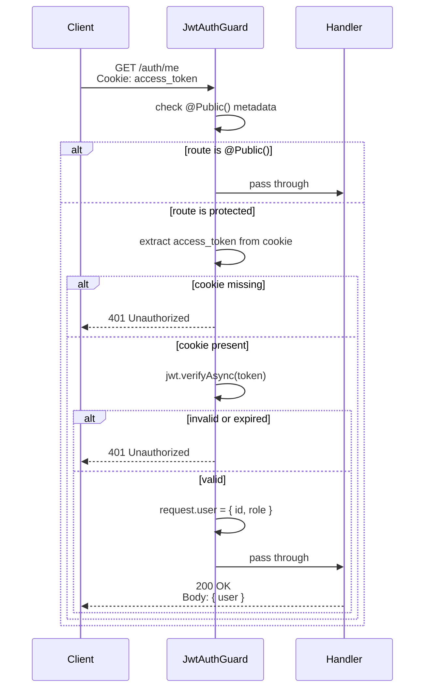

# Authentication

YarnQueue implements a stateless access token (**JWT**) strategy with database-backed **refresh tokens**, supporting revocation, multi-device login, and session limit enforcement.

## Token Strategy

YarnQueue uses a dual-token authentication strategy:

| Token   | Type                     | Lifetime   | Storage                   | Revocable      |
| ------- | ------------------------ | ---------- | ------------------------- | -------------- |
| Access  | JWT (signed)             | 15 minutes | httpOnly cookie           | No (stateless) |
| Refresh | Random opaque (64 bytes) | 7 days     | httpOnly cookie + DB hash | Yes            |

**Why two tokens?**

JSON Web Token (JWT) are commonly used for authentication, but on their own they have one major limitation.

- _A JWT cannot be revoked once issued, even if it is leaked or stolen._

If someone gains access to a user'sJWT, they can use it until it expires. A long expiration is convenient (users do not need to re-login often), but creates a wide window for misuse. A short expiration is safer, but forces frequent re-logins.

So, the solution to this problem is to combine tho tokens with different roles:

- On register or login, the server issues both an **`access_token`** and a **`refresh_token`**, sent to browser as _httpOnly_ cookies.
- The **access_token** is short-lived (15 min) and used for every authenticated request. Is is validated statelessly (no DB lookup).
- The **refresh_token** is long-lived (7 days) and only used to obtain a new access token, against the dedicated `auth/refresh` endpoint.
- When the access token expires, the client calls `/auth/refresh`. The server validates the refresh token against the database (checking expiration and revocation status), updates `last_used_at`, and issues a new access token.
- This cycle repeats until the refresh token expires or is revoked. At that point, the user must log in again.

**Why is the refresh token persisted in the database?**

Persisting the refresh token (as a hash) is what makes revocation possible. A refresh token implemented as just another long-lived JWT would offer no additional security — it would still be unrevocable. Database-backed refresh tokens allow logout, "log out from all devices", and immediate revocation in case of compromise.

## Endpoints

All endpoints are prefixed with `/api/v1`.

| Method | Pat             | Auth Required  | Description                      |
| ------ | --------------- | -------------- | -------------------------------- |
| POST   | `/auth/signup`  | No             | Register a new user (auto-login) |
| POST   | `/auth/login`   | No             | Authenticate existing user       |
| POST   | `/auth/refresh` | Refresh cookie | Renew access token               |
| POST   | `/auth/logout`  | Refresh cookie | Revoke the current session       |

### POST /auth/signup

Create a new user and starts a session (auto-login).

**Request**

```json
{
  "name": "string",
  "email": "user@example.com",
  "password": "string"
}
```

**Response (201 Created)**

```json
{
  "user": {
    "id": "uuid",
    "name": "string",
    "email": "string",
    "role": "CUSTOMER | PRODUCER | ADMIN",
    ...
  }
}
```

Sets two cookies: `access_token` (15 min) and `refresh_token` (7 days, scoped to `/api/v1/auth`).

**Errors**

- `400 Bad Request` - invalid DTO or if an user with this email already registered.

### POST /auth/login

Authenticates an existing user and starts a session.

**Request**

```json
{
  "email": "user@example.com",
  "password": "string"
}
```

**Response (200 OK)**

```json
{
  "user": {
    "id": "uuid",
    "name": "string",
    "email": "string",
    "role": "CUSTOMER | PRODUCER | ADMIN",
    ...
  }
}
```

Sets two cookies: `access_token` (15 min) and `refresh_token` (7 days, scoped to `/api/v1/auth`).

**Errors**

- `400 Bad Request` - invalid DTO
- `401 Unauthorized` - invalid credentials (timing-safe response)

### POST /auth/refresh

Renews the access token using the refresh token cookie.

**Request**

No body. The `refresh_token` cookie is sent automatically by the browser.

**Response (200 OK)**

```json
{
  "success": true
}
```

This endpoint is idempotent — it does not return errors. If no refresh token is present, the response is still 204 with cookies cleared (Level 2 strategy — see [Limitations](#limitations--roadmap)).

**Errors**

- `401 Unauthorized` — refresh token missing, invalid, expired or

### POST /auth/logout

Revokes the refresh token associated with the request and clears auth cookies.

**Request**

No body. The `refresh_token` cookie is sent automatically by the browser.

**Response (204 No Content)**

Empty body. Two cookies are cleared: `access_token` and `refresh_token`.

**Errors**

This endpoint is idempotent — If no refresh token is present, the response is still 204 with cookies cleared.

## Authentication Flows

### Signup

User creates an account with name + email + password. Server validates that
the email is not already registered, creates the user with a hashed password,
and starts a session (auto-login) by setting access + refresh cookies.



The endpoint is **idempotent for client perception** but not for server state:
each successful registration creates a new user. If the email already exists,
the server returns 400 with a generic error message.

> **Known limitation:** Returning 400 for existing emails enables email
> enumeration. See [Limitations & Roadmap](#limitations--roadmap).

### Login

User authenticates with email + password. Server validates credentials,
generates access + refresh tokens, and sets both as httpOnly cookies.



### Refresh

When the access token expires, the client calls `/auth/refresh` with the
refresh cookie. Server validates the refresh against the database, updates
its `last_used_at` timestamp, and issues a new access token.



The refresh token itself is **not rotated** in this flow.
See [Limitations & Roadmap](#limitations--roadmap) for the rationale and
future plan to implement rotation with reuse detection.

If credentials are invalid (wrong password OR user not found), the server
responds with **401 Unauthorized** and a generic message. Both failure
paths execute a bcrypt comparison to keep response time uniform
(timing-attack mitigation).

### Logout

Client revokes the current session. Server marks the refresh token as
revoked in the database and clears both cookies.



Logout is **idempotent**: calling it without a refresh cookie, or with an
already-revoked token, still returns 204 and clears cookies. This avoids
leaking information about token state.

### Authenticated request

Any non-`@Public()` endpoint requires a valid access token. The global
`JwtAuthGuard` intercepts the request, validates the JWT, and populates
`request.user` with the authenticated user's identity.



The guard runs **before any handler**, so endpoints can trust that
`request.user` is populated when they execute. If the access token has
expired, the client should call `/auth/refresh` and retry.

## Cookie Strategy

YarnQueue delivers authentication tokens via **httpOnly cookies** instead of
returning them in response bodies. This is a deliberate security decision
with specific trade-offs.

### Why httpOnly cookies (not localStorage)

Storing tokens in `localStorage` is a common but insecure pattern: any
JavaScript on the page can read it via `document.localStorage.getItem(...)`.
A single XSS vulnerability — from a compromised dependency, an unsanitized
user input, or a malicious browser extension — leaks every active session.

httpOnly cookies are **invisible to JavaScript**. The browser attaches them
to outgoing requests automatically, but `document.cookie` cannot read them.
XSS attacks cannot exfiltrate the tokens.

The trade-off is CSRF (Cross-Site Request Forgery): cookies are sent
automatically, including on requests initiated by other sites. This is
mitigated by the `SameSite` attribute (see below).

### Cookie options used

| Option     | access_token                     | refresh_token                    |
| ---------- | -------------------------------- | -------------------------------- |
| `httpOnly` | true                             | true                             |
| `secure`   | true in production, false in dev | true in production, false in dev |
| `sameSite` | `lax`                            | `lax`                            |
| `maxAge`   | 15 minutes                       | 7 days                           |
| `path`     | `/`                              | `/api/v1/auth`                   |

### Path scoping

The most security-relevant decision in this table is the `path` of the
refresh token. Cookies are only sent on requests whose URL starts with the
cookie's `path`.

- `access_token` has `path: /` — sent on every request to the API, since
  every protected endpoint needs to validate it.
- `refresh_token` has `path: /api/v1/auth` — sent only on auth-related
  endpoints (refresh, logout, future logout-all). It is **not** sent on
  `/products`, `/orders`, etc.

This follows the **principle of least privilege**: the most sensitive
credential (longer-lived, regenerates access) transits the network on as
few routes as possible. If an attacker compromises a non-auth endpoint,
they don't see the refresh token in request headers.

### SameSite=lax explained

`SameSite` controls when cookies are sent on cross-origin requests.

- `strict` — never sent on cross-origin. Most secure, but breaks UX:
  clicking a link from an external site arrives at the app logged out.
- `lax` — sent on top-level navigations (link clicks), not on cross-origin
  fetches (form POSTs from other sites). Reasonable balance.
- `none` — sent on all cross-origin. Requires `secure: true`. Only used
  when frontend and backend are on different domains (e.g., `app.com`
  consuming `api.app.com`).

YarnQueue uses `lax` — the modern browser default and the recommended
choice for most applications.

### Secure flag

`secure: true` forbids the browser from sending the cookie over plain HTTP.
In production, this is mandatory. In local development, `localhost` is not
HTTPS, so `secure: true` would prevent the cookie from being sent at all.
The flag toggles based on `NODE_ENV` (TODO: move to `ConfigService`).

## Security Decisions

Each decision below is intentional, with rationale and known limitations.
Cryptography and authentication are areas where defaults matter, and
choices are explained explicitly.

### Password hashing with bcrypt

Passwords are hashed with **bcrypt** at cost factor 10 (hardcoded for now).

**Why bcrypt:** widely audited, deliberately slow (resistant to brute force),
includes salt automatically.

**Why cost 10 (and not lower or higher):** cost 10 takes ~80ms per hash on
modern hardware. Slow enough to make brute force impractical, fast enough
to keep login responsive. OWASP recommends 12+ for production as of 2026;
this project will move to environment-specific values.

**Future direction:** argon2 is theoretically stronger and is the recommended
choice for new projects starting in 2026+. Migration is non-trivial
(requires re-hashing on next login) and is intentionally deferred.

### Timing-attack mitigation on login

`/auth/login` returns the same error message and **executes the same amount
of work** regardless of whether the email exists. Without this defense,
attackers could enumerate valid emails by measuring response time: a
non-existent email would return in ~1ms, while a valid email with wrong
password would take ~80ms (the bcrypt compare).

The mitigation:

```typescript
if (!foundUser) {
  // bcrypt.compare against a fixed dummy hash to match timing
  await bcrypt.compare(password, TIMING_SAFE_DUMMY_HASH);
  throw new UnauthorizedException('Invalid credentials');
}
```

Both code paths (user not found, wrong password) execute one bcrypt
operation, producing similar response times.

### Database-backed refresh tokens

Refresh tokens are **not JWTs**. They are random 64-byte strings, hashed
(SHA-256) and stored in the `refresh_tokens` table.

**Why not JWT for refresh tokens:** a refresh token implemented as a
long-lived JWT cannot be revoked — once issued, it is valid for its
entire lifetime. Storing a hash in the database allows:

- Immediate revocation (logout, suspected compromise)
- Tracking active sessions per user (multi-device)
- Auditing (`created_at`, `last_used_at`, `revoked_at`)

**Why hash and not plaintext:** if the database is compromised, attackers
cannot use the stored values directly to authenticate. SHA-256 is sufficient
here (unlike for passwords) because the tokens are 64 bytes of high entropy —
brute forcing is infeasible regardless of hash speed.

### Multi-device session management

Each login (or registration) creates a new refresh token record. A user
can have multiple active sessions across devices, each independent. The
`refresh_tokens` table stores `user_agent` and `ip_address` to support
future "active sessions" UI and "log out from all devices" features.

### Session limit (cap)

The number of active refresh tokens per user is capped via
`MAX_ACTIVE_SESSIONS_PER_USER` (default 5). When a new login would exceed
the cap, the oldest active session is revoked automatically.

**Why a cap:** prevents unbounded growth of the `refresh_tokens` table
from misuse (accidental or malicious — a user repeatedly logging in
generates many tokens). The cap is high enough to support real multi-device
usage (phone, laptop, tablet, work computer) without being intrusive.

### Generic error messages

All authentication failures (`/auth/login`, `/auth/refresh`) return the
same generic message regardless of root cause (user not found, wrong
password, token revoked, token expired). The server logs the specific
reason internally for debugging, but the client sees only
"Invalid credentials" or "Invalid refresh token".

This prevents enumeration via error messages — attackers cannot infer
"this email exists" from "this email does not exist".

### Fail-safe defaults via global guard

The `JwtAuthGuard` is registered globally via `APP_GUARD`. All routes are
protected by default; routes that must be public (login, signup, refresh)
opt out explicitly with `@Public()`.

This inverts the more common pattern of "protect specific routes". The
default is the safer behavior. Forgetting to mark a route as public
results in a route that requires auth — annoying for the developer to
discover, but not a security incident. Forgetting to mark a route as
protected (in the opposite pattern) results in a publicly accessible
endpoint — a real vulnerability.

## Limitations & Roadmap

The current implementation is deliberately incremental. Several known
limitations are tracked as issues and will be addressed in future sprints.

### Authentication

- **No refresh token rotation.** Once issued, a
  refresh token is valid for its full 7-day lifetime, even after multiple
  uses. If stolen, an attacker can use it repeatedly until expiration or
  manual revocation.

- **No rate limiting.** `/auth/login`, `/auth/signup`, and `/auth/refresh`
  are publicly reachable without throttling. Brute force is possible
  (slow per attempt due to bcrypt cost, but unlimited in number).

- **Email enumeration via signup.** `/auth/signup` returns 400 if email
  is already registered, allowing attackers to enumerate valid emails.

- **No "active sessions" UI or "log out from all devices" endpoints.**
  The database supports it (multi-device sessions are recorded with
  metadata), but the endpoints are not implemented.

### Configuration & infrastructure

- **No environment variable validation at startup.** Critical config
  (DATABASE_URL, JWT_SECRET, BCRYPT_COST) can be missing or malformed,
  with errors surfacing only at runtime.

- **No automated cleanup of expired/revoked refresh tokens.** The table
  grows indefinitely. A daily cron job will prune old entries.

- **No automated tests.** All validation is currently manual via Postman.
  Unit and E2E tests are planned for Sprint 3.

### Future enhancements

- **Email verification** for new accounts (`active: false` on signup,
  confirmation email).
- **Password reset flow** via email.
- **Two-factor authentication** (TOTP).
- **OAuth providers** (Google, GitHub login).

These are planned but not scoped to a specific sprint yet.
