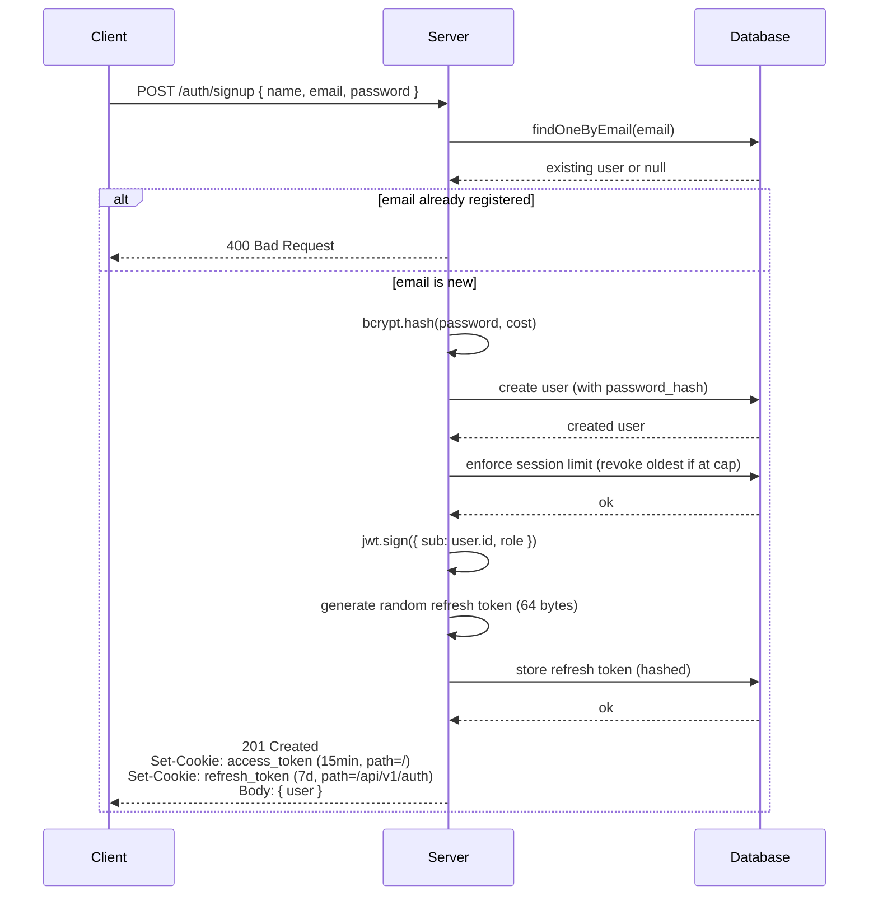
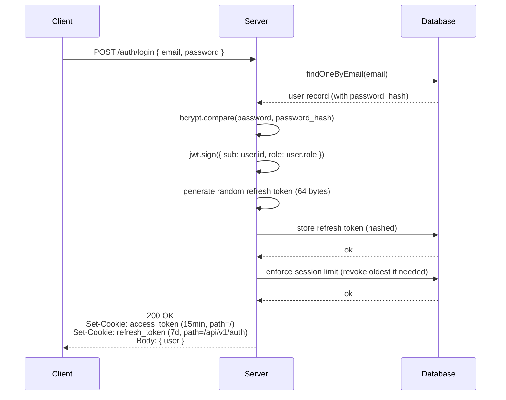
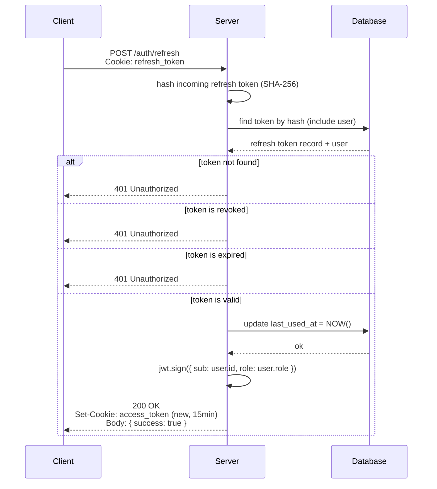
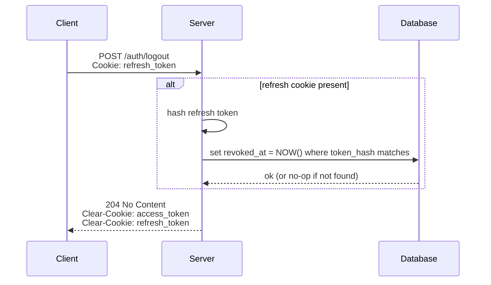
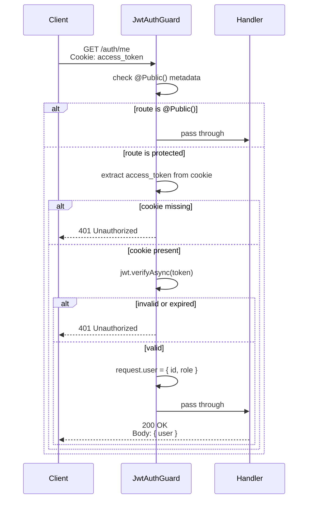

# Authentication

YarnQueue implements a stateless access token (**JWT**) strategy with database-backed **refresh tokens**, supporting revocation, multi-device login, and session limit enforcement.

## Token Strategy

YarnQueue uses a dual-token authentication strategy:

| Token   | Type                     | Lifetime   | Storage                   | Revocable      |
| ------- | ------------------------ | ---------- | ------------------------- | -------------- |
| Access  | JWT (signed)             | 15 minutes | httpOnly cookie           | No (stateless) |
| Refresh | Random opaque (64 bytes) | 7 days     | httpOnly cookie + DB hash | Yes            |

**Why two tokens?**

JSON Web Token (JWT) are commonly used for authentication, but on their own they have one major limitation.

- _A JWT cannot be revoked once issued, even if it is leaked or stolen._

If someone gains access to a user'sJWT, they can use it until it expires. A long expiration is convenient (users do not need to re-login often), but creates a wide window for misuse. A short expiration is safer, but forces frequent re-logins.

So, the solution to this problem is to combine tho tokens with different roles:

- On register or login, the server issues both an **`access_token`** and a **`refresh_token`**, sent to browser as _httpOnly_ cookies.
- The **access_token** is short-lived (15 min) and used for every authenticated request. Is is validated statelessly (no DB lookup).
- The **refresh_token** is long-lived (7 days) and only used to obtain a new access token, against the dedicated `auth/refresh` endpoint.
- When the access token expires, the client calls `/auth/refresh`. The server validates the refresh token against the database (checking expiration and revocation status), updates `last_used_at`, and issues a new access token.
- This cycle repeats until the refresh token expires or is revoked. At that point, the user must log in again.

**Why is the refresh token persisted in the database?**

Persisting the refresh token (as a hash) is what makes revocation possible. A refresh token implemented as just another long-lived JWT would offer no additional security — it would still be unrevocable. Database-backed refresh tokens allow logout, "log out from all devices", and immediate revocation in case of compromise.

## Endpoints

All endpoints are prefixed with `/api/v1`.

| Method | Pat             | Auth Required  | Description                      |
| ------ | --------------- | -------------- | -------------------------------- |
| POST   | `/auth/signup`  | No             | Register a new user (auto-login) |
| POST   | `/auth/login`   | No             | Authenticate existing user       |
| POST   | `/auth/refresh` | Refresh cookie | Renew access token               |
| POST   | `/auth/logout`  | Refresh cookie | Revoke the current session       |

### POST /auth/signup

Create a new user and starts a session (auto-login).

**Request**

```json
{
  "name": "string",
  "email": "user@example.com",
  "password": "string"
}
```

**Response (201 Created)**

```json
{
  "user": {
    "id": "uuid",
    "name": "string",
    "email": "string",
    "role": "CUSTOMER | PRODUCER | ADMIN",
    ...
  }
}
```

Sets two cookies: `access_token` (15 min) and `refresh_token` (7 days, scoped to `/api/v1/auth`).

**Errors**

- `400 Bad Request` - invalid DTO or if an user with this email already registered.

### POST /auth/login

Authenticates an existing user and starts a session.

**Request**

```json
{
  "email": "user@example.com",
  "password": "string"
}
```

**Response (200 OK)**

```json
{
  "user": {
    "id": "uuid",
    "name": "string",
    "email": "string",
    "role": "CUSTOMER | PRODUCER | ADMIN",
    ...
  }
}
```

Sets two cookies: `access_token` (15 min) and `refresh_token` (7 days, scoped to `/api/v1/auth`).

**Errors**

- `400 Bad Request` - invalid DTO
- `401 Unauthorized` - invalid credentials (timing-safe response)

### POST /auth/refresh

Renews the access token using the refresh token cookie.

**Request**

No body. The `refresh_token` cookie is sent automatically by the browser.

**Response (200 OK)**

```json
{
  "success": true
}
```

This endpoint is idempotent — it does not return errors. If no refresh token is present, the response is still 204 with cookies cleared (Level 2 strategy — see [Limitations](#limitations--roadmap)).

**Errors**

- `401 Unauthorized` — refresh token missing, invalid, expired or

### POST /auth/logout

Revokes the refresh token associated with the request and clears auth cookies.

**Request**

No body. The `refresh_token` cookie is sent automatically by the browser.

**Response (204 No Content)**

Empty body. Two cookies are cleared: `access_token` and `refresh_token`.

**Errors**

This endpoint is idempotent — If no refresh token is present, the response is still 204 with cookies cleared.

## Authentication Flows

### Signup

User creates an account with name + email + password. Server validates that
the email is not already registered, creates the user with a hashed password,
and starts a session (auto-login) by setting access + refresh cookies.



The endpoint is **idempotent for client perception** but not for server state:
each successful registration creates a new user. If the email already exists,
the server returns 400 with a generic error message.

> **Known limitation:** Returning 400 for existing emails enables email
> enumeration. See [Limitations & Roadmap](#limitations--roadmap).

### Login

User authenticates with email + password. Server validates credentials,
generates access + refresh tokens, and sets both as httpOnly cookies.



### Refresh

When the access token expires, the client calls `/auth/refresh` with the
refresh cookie. Server validates the refresh against the database, updates
its `last_used_at` timestamp, and issues a new access token.



The refresh token itself is **not rotated** in this flow.
See [Limitations & Roadmap](#limitations--roadmap) for the rationale and
future plan to implement rotation with reuse detection.

If credentials are invalid (wrong password OR user not found), the server
responds with **401 Unauthorized** and a generic message. Both failure
paths execute a bcrypt comparison to keep response time uniform
(timing-attack mitigation).

### Logout

Client revokes the current session. Server marks the refresh token as
revoked in the database and clears both cookies.



Logout is **idempotent**: calling it without a refresh cookie, or with an
already-revoked token, still returns 204 and clears cookies. This avoids
leaking information about token state.

### Authenticated request

Any non-`@Public()` endpoint requires a valid access token. The global
`JwtAuthGuard` intercepts the request, validates the JWT, and populates
`request.user` with the authenticated user's identity.



The guard runs **before any handler**, so endpoints can trust that
`request.user` is populated when they execute. If the access token has
expired, the client should call `/auth/refresh` and retry.

## Cookie Strategy

- **`Coming soon`** — httpOnly, SameSite, Path scoping decisions.

## Security Decisions

- **`Coming soon`** — timing attack mitigation, password hashing, session cap.

## Limitations & Roadmap

- **`Coming soon`** — known limitations and link to roadmap issues
